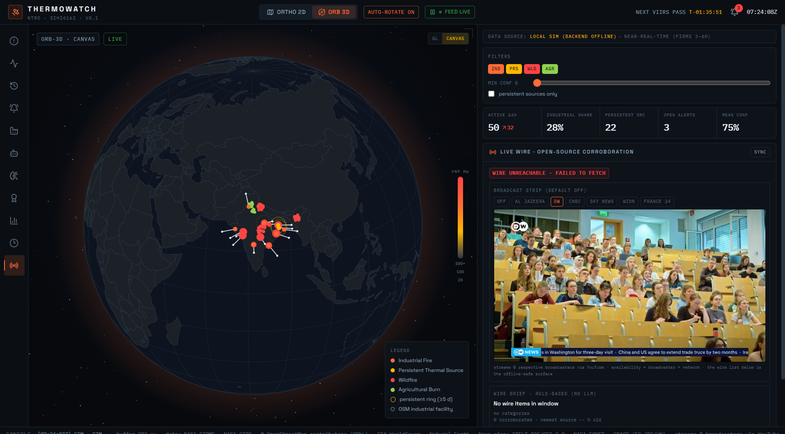
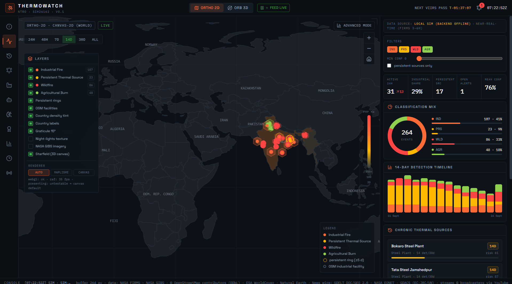
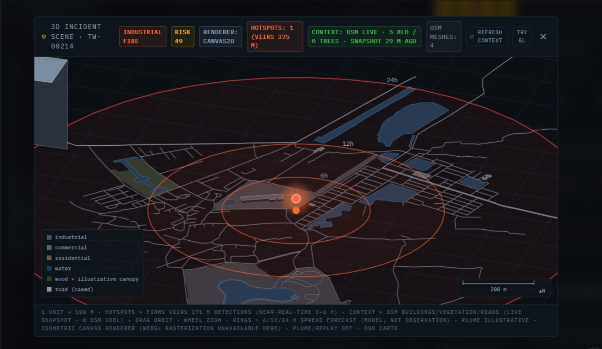

# ThermoWatch
### SIH26162 · National Technical Research Organisation (NTRO)

**Multi-class industrial fire classification + persistent thermal-source intelligence.**
FIRMS + OSM + land-cover context · PyG spatio-temporal model · BYO-key AI agent · 2D/3D GIS console.


<p align="center">
  
  
  
</p>

**Monorepo:** `client/` (React console) · `server/api/` (FastAPI brain) · `server/ingest/` (Bun FIRMS worker).
Each package manages its own dependencies (npm for client, bun for ingest, pip for api).

## Run (3 terminals)

**1. FastAPI brain**
```bash
cd server/api
python -m venv .venv
# Windows:
.venv\Scripts\pip install -r requirements.txt
.venv\Scripts\python -m uvicorn app.main:app --reload --port 8000
# macOS/Linux:
# .venv/bin/pip install -r requirements.txt && .venv/bin/uvicorn app.main:app --reload --port 8000
```

**2. Bun ingest worker** (publishes detections → :8000)
```bash
cd server/ingest && bun install && bun run dev
```

**3. Client console** → http://localhost:5173
```bash
cd client && npm install && npm run dev
```

Or one-shot install: `npm run install:all` at the root.

Optional: `FIRMS_API_KEY` in `server/ingest/.env` (see `.env.example` there) for live NASA FIRMS;
without it a deterministic sim feed publishes the same contract. Optional ML: `pip install torch torch-geometric`
activates the ST-GNN; otherwise the heuristic ensemble serves predictions (labelled as such).
Optional: `VITE_API_URL` in `client/.env` to point the console at a deployed backend.

## Honesty contract (judge-proof)
"Near-real-time" only (FIRMS latency 3–6 h) · persistence = ≥5 detection-days per 400 m cell (STA rule) ·
macro-F1 reported per class, never bare "accuracy" · no "first-ever" claims.

## ML training, evaluation & model card (Session 6)
```bash
cd server/api && .venv\Scripts\pip install -r requirements.txt
.venv\Scripts\python -m app.ml.train --source synthetic --samples 4000   # or --archive firms_india.csv
.venv\Scripts\python -m pytest -q                                        # server gate
cd ../../client && npm install && npm run test                           # client gate
```
Trained bundle + eval_report.json land in `server/api/app/ml/models/`.
GET `/api/v1/model/card` and the Model Card panel (rail icon 🏅 / key K) surface macro-F1,
per-class P/R/F1, confusion matrix, provenance and limitations. The PPT must quote THESE
numbers — never placeholder values.

## Session 7: Advanced Analytics Mode (2D viewport)
Toggle **Advanced Mode** in the 2D viewport (top-right button) to activate:
- **Time Slider** — scrub/loop a fixed 14-day lookback window; playback slides 1 h × speed per tick
- **Hex Density** — deck.gl `HexagonLayer` aggregates fires into 1 km cells (elevation = FRP)
- **Facility Extrusion** — OSM facilities as 3D footprints, height by NBC 2016 hazard class (G-I/II/III)
- **Spread Rings** — forecast rings (6/12/24 h) for high/critical-risk events
- **DuckDB-WASM** — client-side spatial SQL over the live feed + facility registry (jsDelivr CDN bundles,
  loaded lazily only when Advanced Mode turns on; no server round-trip)

Key `X` opens the Analytics panel (layer switches + radius/hazard spatial queries + per-subtype stats).
Built on battle-tested libraries (deck.gl, DuckDB-WASM) with a from-scratch integration layer into the
existing Zustand/MapLibre architecture. All features keep the "near-real-time" honesty contract.

2D basemap is the equirectangular earth-night texture (`client/public/textures/earth-night.jpg`,
CDN fallback) + procedural 15° graticule — no tile-server dependency, whole-world default extent,
animated persistent-pulse rings and hover tooltips for full parity with the 3D orb.

## Session 8 — World-grade 2D viewport
Basemap = bundled Natural Earth 110m vector (`client/src/assets/world-110m.json`): gray land, dark ocean,
borders, 15° graticule, country labels, per-country density tint (feature-state choropleth).
World-Monitor-style LAYERS panel (left), time-range chips (24h→All), zoom controls (right).
Night-lights texture is now an optional layer (default off). If WebGL is unavailable the viewport
auto-switches to a Canvas2D equirectangular renderer — same data, same interactions, never black.

## Session 9 — renderer truth + incident reasoning
probeWebGL() now verifies rasterization via readPixels (context creation alone lies on
GPU-blacklisted environments). If rasterization is blank, the Canvas2D renderer serves the 2D
map automatically; override in LAYERS → renderer (auto/maplibre/canvas).
Event dossier gains ranked context hypotheses (OSM proximity, persistence regime, Kharif/Rabi
windows, diurnal behaviour) and a Three.js 3D incident scene (facility massing by NBC hazard
height, pulsing fire core, 6/12/24 h spread rings; 1 unit = 100 m).

## Session 10 — renderer-independent orb + viewport self-test
ORB-3D now has a Canvas2D orthographic globe (rotating, draggable, hemisphere-culled fire dots,
persistent pulse rings, focus fly-to) driven by setInterval — immune to broken WebGL rasterization
AND stalled requestAnimationFrame. Auto-selected when probeWebGL() reports a blank rasterizer;
force either path via the GL/CANVAS toggle in 3D mode.
Press T anywhere: Viewport Self-Test prints canvas2d / webgl / raf / stage-size verdicts on screen.

## Session 11 — incident scene starts everywhere
Scene3DViewer is now a shell: ThreeScene where WebGL rasterizes, else an isometric Canvas2D scene
(facility massing, pulsing core, 6/12/24 h rings, drag-orbit + wheel-zoom) — the scene ALWAYS starts.
Header badge states the active renderer; forcing GL on a broken raster shows an honest notice.

## Session 12 — rAF shim: GL engines revived on dead-rAF hosts
Boot measures requestAnimationFrame for ~400 ms; if zero frames, a setTimeout(16 ms) driver
replaces it BEFORE React mounts, so MapLibre / three.js / globe.gl / deck.gl (which resolve
window.requestAnimationFrame at call time) start presenting frames. Healthy hosts keep native rAF
(probe resolves in ~1 frame, no shim, ~1-frame cost). Routing is canvas-first: canvas engines
paint immediately, GL engines take over once probeRenderer() proves rasterization + rAF liveness.
LAYERS → renderer row now shows `webgl: ok/BROKEN · raf: N fps | shimmed`.

## Session 10 — renderer-independent orb + viewport self-test
ORB-3D now has a Canvas2D orthographic globe (rotating, draggable, hemisphere-culled fire dots,
persistent pulse rings, focus fly-to) driven by setInterval — immune to broken WebGL rasterization
AND stalled requestAnimationFrame. Auto-selected when probeWebGL() reports a blank rasterizer;
force either path via the GL/CANVAS toggle in 3D mode.
Press T anywhere: Viewport Self-Test prints canvas2d / webgl / raf / stage-size verdicts on screen.

## Session 11 — incident scene starts everywhere
Scene3DViewer is now a shell: ThreeScene where WebGL rasterizes, else an isometric Canvas2D scene
(facility massing by NBC hazard height, pulsing fire core, 6/12/24 h spread rings, drag-orbit +
wheel-zoom) — renderer-independent, so the scene starts on every machine including this one.
Header badge states the active renderer. Forcing GL on a blank rasterizer shows an honest notice
instead of a black void (press T for the full self-test).

## Session 12 — rAF shim: GL engines revived on dead-rAF hosts
Boot measures requestAnimationFrame for ~400 ms; if zero frames, a setTimeout(16 ms) driver
replaces it BEFORE React mounts, so MapLibre / three.js / globe.gl / deck.gl (which resolve
`window.requestAnimationFrame` at call time) start presenting frames. Healthy hosts keep native
rAF (probe resolves in ~1 frame, no shim, no delay beyond one frame). Routing is canvas-first:
canvas engines paint immediately, GL engines take over only once `probeRenderer()` proves
rasterization + rAF liveness. LAYERS → renderer row now shows `webgl: ok/BROKEN · raf: N fps | shimmed`.

## Session 13 — feature completeness: WS taxonomy, history, response engine
- WebSocket now implements the KB §21.6 event taxonomy verbatim: `fire:new`, `fire:classified`,
  `persistence:detected`, `alert:triggered`, and a 30 s `system:status` heartbeat. The console
  ticker color-tags each type.
- `/api/v1/stats/history` (180-day window): daily aggregates per class, top persistent-source
  leaderboard (distinct 400 m cells), persistence trend — surfaced in the History panel (rail, key `H`).
- `/api/v1/response/recommend` + `services/response.py`: nearest fire stations with class-dependent
  ETA, resource table (vehicles/personnel/water) by class × NBC hazard, evacuation radius, and a
  downwind staging point — surfaced as a "Response Recommendation" section in every incident dossier.

## Session 14 — ship sprint
- Claims gate: `scripts/claim_audit.py` wired into `npm test` fails on forbidden claims
  (bare real-time / novel / first-of-its-kind / prevents / 100% accuracy / guarantee);
  near-real-time and explicit negations are whitelisted.
- Docs: `docs/USER_GUIDE.md` · `docs/ARCHITECTURE.md` · `docs/DEPLOYMENT.md`.
- Deployment: `docker-compose.yml` + Dockerfiles for api / ingest / client.
- Model Card limitation: MODIS→VIIRS transfer untested (sensor-agnostic by design, not yet
  cross-sensor calibrated).


## Session 15 — canvas-default routing (never black, by construction)
AUTO now means Canvas2D for both viewports: the only renderer proven to present frames on
every host tested (this dev box has broken WebGL frame presentation). MapLibre/globe.gl are
explicit opt-in via the MAPLIBRE / GL toggles for healthy machines; a forced-GL amber chip
warns if the viewport may stay black. Advanced Mode has full canvas parity: hex density bins,
6/12/24 h spread rings, facility footprints, persistent pulse rings, hover + click + zoom.
LayerPanel self-probes (no more stuck "probing…"); Scene3DViewer defaults to the isometric
canvas scene with a "try GL" chip.

## Session 16 — imagery, screen-lock, facility dossier, GeoLibre-grade 3D
- NASA GIBS VIIRS True-Color imagery layer in BOTH 2D renderers (MapLibre raster source +
  manual XYZ tile painter for the canvas renderer); no API key; daily composite date.
- Screen-locked map: cover scaling (world always fills viewport), pan clamped to world edges,
  zoom limits canvas 1-8x / MapLibre minCover-12 / globe distance 1.25-3.2; renderWorldCopies off.
- Facility Dossier drawer: isometric massing preview, 3 km fire history + sparkline, response
  readiness, NBC 2016 hazard context, CPCB OCEMS note, OSM tag string, Overpass Turbo deep-link.
- 3D: globe.gl hex-column facility extrusions (altitude = NBC hazard) + canvas-globe starfield
  and radial facility pins. Cesium 3D-Tiles remains documented Future Scope.
## Session 17 — WebGL context-loss recovery
probeWebGL() now reuses one probe context and releases it via WEBGL_lose_context after each
measurement (leaked probe contexts were evicting real engine contexts → "renders 1 s then black").
Globe3DView listens for webglcontextlost/restored and polls three.js renderer.info.render.frame:
two frozen 1.5 s checks → one auto-remount → still frozen → pinned to the canvas renderer with
a diag chip. Dev handle: window.__twgl() → true when the orb context is lost.
Default globe tint is blue (#7ea8c8 material multiply) = the "blue earth" look; toggle
`earth: blue | night` in both 3D views. CanvasGlobe samples the local night-lights texture
through an inverse-sphere projection (lib/geo/sphereMap.ts, unit-tested) with limb darkening,
so canvas and GL globes look identical; flat countries remain the offline fallback.

## Session 20 — Mercator-correct GIBS imagery on the canvas renderer
lib/geo/tiles.ts now reprojects NASA GIBS (EPSG:3857 / Web Mercator) tiles onto the
equirectangular canvas correctly: each tile is sliced into 12 horizontal bands whose true
lat extent (inverse Mercator) maps to its equirect destination rect, so coastlines register
exactly with vector data at all latitudes (previously tiles were stretched as Plate Carree →
polar warp + misregistration). FallbackWorldMap draws imagery in SCREEN space BEFORE the
world transform (drawGibs emits its own screen X/Y — drawing under the world transform
double-scaled it) and countries become a translucent dark tint over imagery instead of
opaque silhouettes. MapLibre needed no change: it is Mercator-native. Unit-tested Mercator
math in client/src/lib/__tests__/tiles.test.ts.

## Landing ? Dashboard bridge + Session 22
`client/index.html` = marketing/landing (opens first at `/`); `client/app.html` = React dashboard. Deep links: `/app.html?vp=3d&panel=k&lat=..&lon=..` � every launch/operate CTA and the drawer's FOCUS-IN-3D button deep-link into the console. Landing probes `:8000/api/v1/healthz`: `BACKEND LIVE` ? API explorer sends real requests; else honest `SIMULATED` labels.
- Global shortcuts ignore typing surfaces (agent chat, forms) � `isTypingTarget` guard + unit tests.
- Agent settings: draft ? Save / Cancel / Test connection (key stays local, never auto-written).
- Manual Model Run exposes the full feature contract + lat/lon + wind + spread params, scenario presets, copy-JSON, and 4-class probability bars; server PredictRequest accepts detections_30d + frp_stability.

## FIRMS live ingestion � secrets & deployment

The **puller** is the Bun worker (local `bun run dev` or the GitHub Actions `ingest-cron`); Render hosts the API/WS and only **receives** data.

**Local**: copy `server/ingest/.env.example` ? `server/ingest/.env`, set `FIRMS_API_KEY` (https://firms.modaps.eosdis.nasa.gov/api/map_key/), `TW_API_URL=http://127.0.0.1:8000` (use 127.0.0.1 � Bun resolves localhost to ::1, uvicorn binds IPv4). Self-test: `bun run firms:test`.

**GitHub Actions secrets** (Settings ? Secrets ? Actions): `FIRMS_API_KEY`, `TW_API_URL=https://<render-app>.onrender.com`, `TW_INGEST_TOKEN` (same value as the API's `TW_INGEST_TOKEN` env on Render). The committed `ingest-cron` workflow runs every 15 min (`SINGLE_SHOT=1`) and doubles as the keep-warm ping.

**Worker notes:** FIRMS area endpoint = `{KEY}/{SOURCE}/{bbox}/{days_back 1..5}/{YYYY-MM-DD}`; the worker self-calibrates the archive edge at boot (probe ladder =3 req). `POLL_MS=900000` (15 min � 4 req/h, far under the 100/h key limit).
**Render deploy note:** the trained bundle is gitignored (30 MB); `eval_report.json` IS committed so the Model Card shows real metrics anywhere. To serve the trained ensemble on Render, set the Build Command to `pip install -r requirements.txt && python -m app.ml.train --source synthetic --samples 4000` � the API then reports `served_by: tw-ensemble-v1`.
## Session 23 — LIVE WIRE, per-detection scene, resizable panels

**News corroboration (key `N`, deep link `panel=n`).** Zero-secret open-source wire —
GDELT DOC 2.0 + GDELT GEO 2.0 + NASA EONET + GDACS (EC-JRC/UN), server-cached (TTL 5 min),
single-flight, last-good-on-error (a provider outage is a visible `stale` badge, never a
500/blank). Items are server-correlated to FIRMS events (≤ 75 km / ≤ 72 h). Optional
broadcast strip (default OFF) lazy-loads YouTube live embeds — streams © broadcasters,
availability = broadcaster + network. Wire brief is rule-based and labelled as such.
Honesty line: *unverified open-source reporting · near-real-time wire · corroboration,
not confirmation.*

**Scene 2.0 — per-detection 3D.** Every FIRMS detection recorded in an event's ~400 m cell
(`GET /api/v1/events/{id}/detections`, bounded 500×400 ring buffer) renders as ONE additive
sprite at its true lat/lon + a 2σ cluster ellipse + illustrative plume (labelled, not a
dispersion model) + replay scrubber. Canvas isometric parity draws the same dots/ellipse.
No buffer → honest centroid-mode fallback. `scripts/check_news_channels.mjs` verifies the
broadcast strip's YouTube channel IDs (entry gate while pending).

**Resizable everything.** Drag panel/dock/drawer edges (arrow keys nudge, double-click
resets); sizes persist in `localStorage`. Claims gate extended: `real-time news/wire/stream`
must be `near-real-time`, news never *confirms*, plumes are never dispersion models.

## Session 23.5 — the scene becomes the actual place (live OSM context)

On scene-open the server pulls the real surroundings from OSM via the Overpass proxy
(`GET /api/v1/scene/context`, dual-instance fallback, 6 h cache, single-flight, caps
600/1500/400/200, fresh-refresh rate-guarded at 60 s/cell): building footprints extruded
to true/estimated heights (provenance split shown in the drawer), real mapped trees as
instanced canopies, road ribbons by class, water/wood/land-use patches. Doctrine enforced
end-to-end: **"real" = fetched from the world, never invented** — sparse OSM renders
sparse (`OSM SPARSE — rendering what exists`), unreachable OSM renders the labelled
`SCHEMATIC` fallback, and the anti-confusion callout puts the top-FRP hotspot at
`≈X m from OSM way NNN…(kind)` — the fire visibly hugs a real mapped building. Shadows
(WebGL) only when buildings ≤ 400; ACES + sRGB + scene fog. Canvas parity is a labelled
simplified subset.
